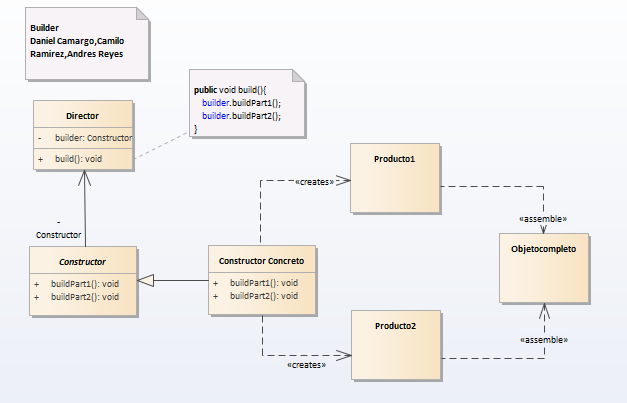

# Builder

__"Separe la construcción de un objeto complejo de su representación para que el mismo proceso de construcción pueda crear representaciones diferentes." __ [GoF]

## Model

## Example

### Codigo
  

