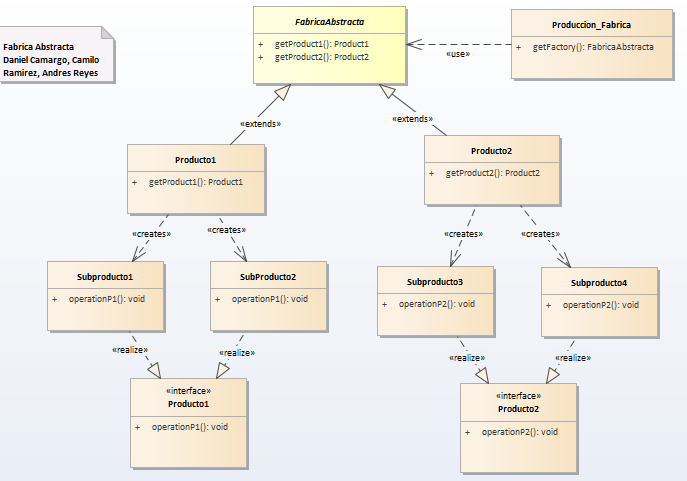

# Abstract Factory

__ "Proporcionar una interfaz para crear familias de objetos relacionados o dependientes sin especificar sus clases concretas". __ [GoF]
Este patrón crea diferentes familias de objetos. Su objetivo principal es soportar múltiples estándares que vienen definidos por las diferentes jerarquías de herencia de objetos. Es similar al Factory Method, sólo que esta orientado a combinar productos.

Se debe utilizar este patrón cuando:
Un sistema se debe configurar con una de entre varias familias de productos.
Una familia de productos relacionados están hechos para utilizarse juntos.

## Model

## Codigo

### Functional Model
  

  <pre><code>
  /*
 * To change this template, choose Tools | Templates
 * and open the template in the editor.
 */
package patrones.creacionales.abstractfactory;

import java.util.Scanner;
import patrones.Ejemplo;
import patrones.creacionales.abstractfactory.fabricas.FabricaAbstracta;
import patrones.creacionales.abstractfactory.fabricas.FabricaAmd;
import patrones.creacionales.abstractfactory.fabricas.FabricaIntel;
import patrones.creacionales.abstractfactory.productos.Board;
import patrones.creacionales.abstractfactory.productos.Memoria;
import patrones.creacionales.abstractfactory.productos.Procesador;

/**
 *
 * @author chamo
 */
public class EjemploAbstractFactory implements Ejemplo {

    FabricaAbstracta fabrica;
    Memoria memoria;
    Procesador procesador;
    Board board;
    Scanner escaner;
    int opcion = 0;

    @Override
    public void operacion() {
        escaner = new Scanner(System.in);

        do {
            System.out.println("Ingrese 1 para AMD o 2 para Intel");
            opcion = escaner.nextInt();
        } while (opcion != 1 && opcion != 2);

        switch (opcion) {
            case 1:
                fabrica = new FabricaAmd();
                break;
            case 2:
                fabrica = new FabricaIntel();
                break;
        }

        board = fabrica.crearBoard();
        memoria = fabrica.crearMemoria();
        procesador = fabrica.crearProcesador();

        System.out.println(board.operacion());
        System.out.println(procesador.operacion());
        System.out.println(memoria.operacion());

    }
}
<code>
