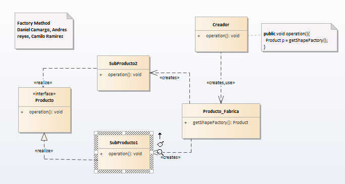

# Factory Method

__ "Defina una interfaz para crear un objeto, pero deje que las subclases decidan a qué clase instanciar. Factory Method permite que una clase retrase la creación de instancias en subclases." __ [GoF]

## Model

## Codigo

### Functional Model
  

