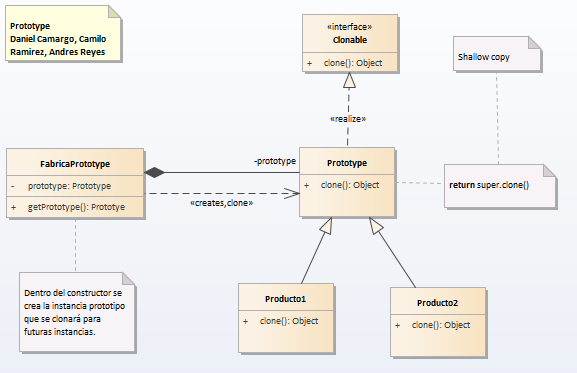

# Prototype

__"Specify the kinds of objects to create using a prototypical instance and create new objects by copying this prototype ."__ [GoF]
El patrón prototype tiene un objetivo muy sencillo: crear a partir de un modelo.Permite crear objetos prediseñados sin conocer detalles de cómo crearlos. Esto lo logra especificando los prototipos de objetos a crear. Los nuevos objetos que se crearán de los prototipos, en realidad, son clonados. Vale decir, tiene como finalidad crear nuevos objetos duplicándolos, clonando una instancia creada previamente.

Cuando utilizar este patrón.

Aplica en un escenario donde sea necesario la creación de objetos parametrizados como "recién salidos de fábrica" ya listos para utilizarse, con la gran ventaja de la mejora de la performance: clonar objetos es más rápido que crearlos y luego setear cada valor en particular.
Este patrón debe ser utilizado cuando un sistema posea objetos con datos repetitivos, en cuanto a sus atributos: por ejemplo, si una biblioteca posee una gran cantidad de libros de una misma editorial, mismo idioma, etc. Hay que pensar en este patrón como si fuese un fábrica que tiene ciertas plantillas de ejemplos de sus prodcutos y, a partir de estos prototipos, puede crear una gran cantidad de productos con esas características.

## Model

## Example

### Functional Model
  

### Structural Model
  
