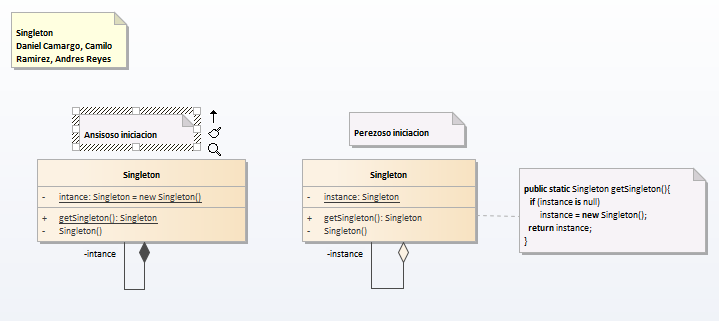

# Singleton

__"Ensure a class has only one instance, and provide a global point of access to it."__ [GoF]
La idea del patrón Singleton es proveer un mecanismo para limitar el número de instancias de una clase. Por lo tanto el mismo objeto es siempre compartido por distintas partes del código. Puede ser visto como una solución más elegante para una variable global porque los datos son abstraídos por detrás de la interfaz que publica la clase singleton.
Dicho de otra manera, esta patrón busca garantizar que una clase sólo tenga una instancia y proporcionar un punto de acceso global a ella.

Usaremos este patrón cuando:
♦ Debe haber exactamente una instancia de una clase y deba ser accesible a los clientes desde un punto de acceso conocido.
♦ Se requiere de un acceso estandarizado y conocido públicamente.

Sus usos más comunes son clases que representan objetos unívocos. Por ejemplo, si hay un servidor que necesita ser representado mediante un objeto, este debería ser único, es decir, debería existir una sola instancia y el resto de las clases deberían de comunicarse con el mismo servidor. Un Calendario, por ejemplo, también es único para todos.
No debe utilizarse cuando una clase esta representando a un objeto que no es único, por ejemplo, la clase Persona no debería ser Singleton, ya que representa a una persona real y cada persona tiene su propio nombre, edad, domicilio, DNI, etc.

## Model

## Example

### Functional Model
  

### Structural Model
  
