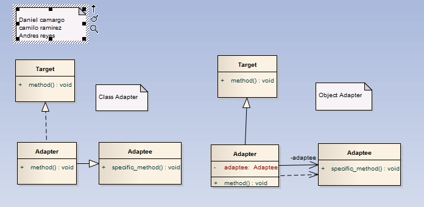

# Adapter

>"Busca una manera estandarizada de adaptar un objeto a otro. Se utiliza para transformar una interfaz en otra, de tal modo que una clase que no pudiera utilizar la primera, haga uso de ella a través de la segunda.
Es conocido como Wrapper (al patrón Decorator también se lo llama Wrapper, con lo cual es nombre Wrapper muchas veces se presta a confusión).
Una clase Adapter implementa un interfaz que conoce a sus clientes y proporciona acceso a una instancia de una clase que no conoce a sus clientes, es decir convierte la interfaz de una clase en una interfaz que el cliente espera. Un objeto Adapter proporciona la funcionalidad prometida por un interfaz sin tener que conocer que clase es utilizada para implementar ese interfaz. Permite trabajar juntas a dos clases con interfaces incompatibles.

Este patrón se debe utilizar cuando:
Se quiere utilizar una clase que llame a un método a través de una interface, pero se busca utilizarlo con una clase que no implementa ese interface.
Se busca determinar dinámicamente que métodos de otros objetos llama un objeto.
No se quiere que el objeto llamado tenga conocimientos de la otra clase de objetos."

## Model

## Example

### Functional Model
  

### Structural Model
  
