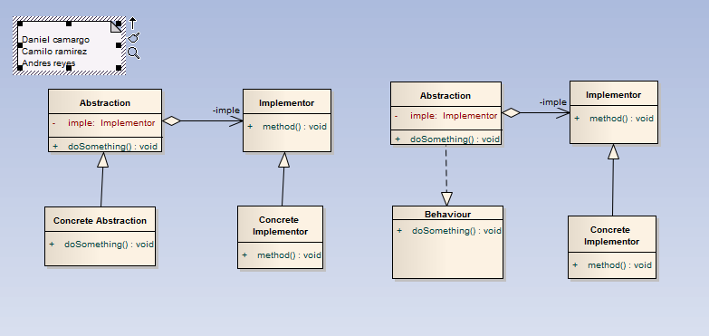

# Bridge

>"Define separate inheritance hierarchies for an abstraction and its implementation. Abstraction delegates its implementation to an Implementor object instead of committing to an implementation at compile-time.
Desacopla una abstracción de su implementación, de manera que ambas puedan variar de forma independiente. ¿Que quiere decir exactamente esto? Una abstracción se refiere a un comportamiento que una clase debería implementar, ya sea porque esta obligada por una interface o una clase abstracta. Por otro lado, con implementación se refiere a colocarle lógica a dicha obligación.
Con lo cual, este patrón permite modificar las implementaciones de una abstracción en tiempo de ejecución. Básicamente es una técnica usada en programación para desacoplar la interface de una clase de su implementación, de manera que ambas puedan ser modificadas independientemente sin necesidad de alterar por ello la otra.

Cuando un objeto tiene unas implementaciones posibles, la manera habitual de implementación es el uso de herencias. Muchas veces la herencia se puede tornar inmanejable y, por otro lado, acopla el código cliente con una implementación concreta. Este patrón busca eliminar la inconveniencia de esta solución. 

Este patrón debe ser utilizado cuando:
Se desea evitar un enlace permanente entre la abstracción y su implementación. Esto puede ser debido a que la implementación debe ser seleccionada o cambiada en tiempo de ejecución.
Tanto las abstracciones como sus implementaciones deben ser extensibles por medio de subclases. En este caso, el patrón Bridge permite combinar abstracciones e implementaciones diferentes y extenderlas independientemente.
Cambios en la implementación de una abstracción no deben impactar en los clientes, es decir, su código no debe tener que ser recompilado.
Se desea compartir una implementación entre múltiples y este hecho debe ser escondido a los clientes.
Permite simplificar jerarquías demasiado pobladas."

## Model

## Example

### Functional Model
  

### Structural Model
  
>
