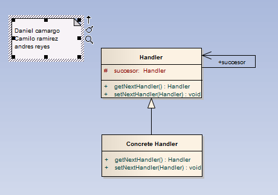

# Chain of Responsibility

>"Avoid coupling the sender of a request to its receiver by giving more than one object a chance to handle the request. Chain the receiving objects and pass the request along the chain until an object handles it.
Desacopla una abstracción de su implementación, de manera que ambas puedan variar de forma independiente. ¿Que quiere decir exactamente esto? Una abstracción se refiere a un comportamiento que una clase debería implementar, ya sea porque esta obligada por una interface o una clase abstracta. Por otro lado, con implementación se refiere a colocarle lógica a dicha obligación.
Con lo cual, este patrón permite modificar las implementaciones de una abstracción en tiempo de ejecución. Básicamente es una técnica usada en programación para desacoplar la interface de una clase de su implementación, de manera que ambas puedan ser modificadas independientemente sin necesidad de alterar por ello la otra.

Cuando un objeto tiene unas implementaciones posibles, la manera habitual de implementación es el uso de herencias. Muchas veces la herencia se puede tornar inmanejable y, por otro lado, acopla el código cliente con una implementación concreta. Este patrón busca eliminar la inconveniencia de esta solución. 

Este patrón debe ser utilizado cuando:
Se desea evitar un enlace permanente entre la abstracción y su implementación. Esto puede ser debido a que la implementación debe ser seleccionada o cambiada en tiempo de ejecución.
Tanto las abstracciones como sus implementaciones deben ser extensibles por medio de subclases. En este caso, el patrón Bridge permite combinar abstracciones e implementaciones diferentes y extenderlas independientemente.
Cambios en la implementación de una abstracción no deben impactar en los clientes, es decir, su código no debe tener que ser recompilado.
Se desea compartir una implementación entre múltiples y este hecho debe ser escondido a los clientes.
Permite simplificar jerarquías demasiado pobladas." [GoF]

## Model
  

## Example

### Functional Model
  

### Structural Model
  
>
<pre><code>
// NOTA: la clase Mensaje no está implemntada por simplicidad e irrelevancia 

// Mensaje tiene los métodos siguientes:

//    Mensaje(String codificacion, String text);

//    String obtenerCodificacion();

//    String desencriptar(String key);

// En primer lugar definiremos la clase abstracta ManejadorMensaje

public absatract class ManejadorMensaje{

        ManejadorMensaje proximo;

        public void establecerProximo(ManejadorMensaje proximo){

                this.proximo = proximo;

        }

    public abstract void manejarMensaje(Mensaje msg);

}

// Seguiremos con el manejador concreto PolicíaEstándar

public class PoliciaEstandar extends ManejadorMensaje{

        private String key = "0069A0";

        @Override

        public void manejarMensaje(Mensaje msg){

                if(msg.obtenerCodificacion().equals("base"))

                        System.out.println(desencriptar(key));

                else

                        this.proximo.manejarMensaje(msg);

        }

}

// Otro manejador concreto PolicíaEspecial

public class PoliciaEspecial extends ManejadorMensaje{

        private String key = "0A89E4";

        @Override

        public void manejarMensaje(Mensaje msg){

                if(msg.obtenerCodificacion().equals("especial"))

                        System.out.println(desencriptar(key));

                else

                        this.proximo.manejarMensaje(msg);

        }

}

// Por ultimo crearemos PolicíaElite

public class PoliciaElite extends ManejadorMensaje{

        private String master_key = "F0FEF2";

        @Override

        public void manejarMensaje(Mensaje msg){

                System.out.println(desencriptar(master_key));

        }

}

// Ahora crearemos la clase principal de nuestro cliente

// Le pasará el mensaje codificado a la cadena de policías

public static void main(String [] args){

        ManejadorMensaje policia1 = new PoliciaEstandar();

        ManejadorMensaje policia2 = new PoliciaEspecial();

        ManejadorMensaje policia3 = new PoliciaElite();

        policia1.establecerProximo(policia2);

        policia2.establecerProximo(policia3);

        Mensaje mensaje = new Mensaje("especial", "Este mensaje va para la policía especial");

        policia1.manejarMensaje(mensaje);

        mensaje = new Mensaje("top-secret", "Este mensaje va para la policía de élite");

        policia1.manejarMensaje(mensaje);

}

<code>
