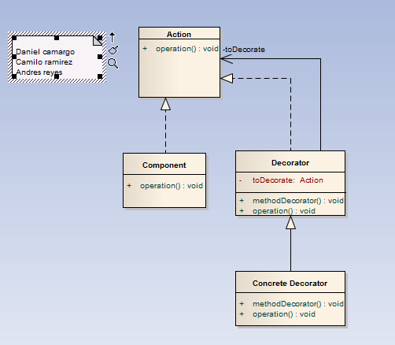

# Decorator

>"Define separate Decorator objects that add responsibilities to an object. Work through Decorator objects to extend the functionality of an object at run-time.
Es recomendable leer este post luego de haber leído los patrones Adapter y Decorator, ya que a ambos se los llama Wrapper ("envoltorio"). Es probable que quien haya leído por primera vez a ambos patrones no entiendan como es posible tamaña comparación entre ambos, siendo tan diferenciados: un decorador solo cambia las responsabilidades del objeto, no su interface. El patrón Adapter cambia el interface."

## Model

## Example

### 
<pre><code>
package patrones.estructurales.decorator;

import patrones.Ejemplo;

/**
 *
 * @author daza
 */
public class EjemploDecorator implements Ejemplo{

    @Override
    public void operacion() {
        Component real = new RealComponent();
        System.out.println(real.doThis());
        Component wrapper = new WrapperUno(real);
        System.out.println(wrapper.doThis());
        Component wrapper2 = new WrapperUno(wrapper);
        System.out.println(wrapper2.doThis());
       
    }
    
}
/<code>
  /<pre>

  

### Structural Model
  
>
