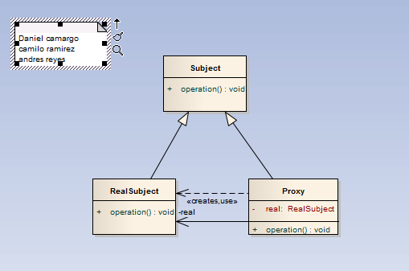

# Proxy - Surrogate

>"Provide a surrogate or placeholder for another object to control access to it.
El patrón Proxy se utiliza como intermediario para acceder a un objeto, permitiendo controlar el acceso a él. Para ello obliga que las llamadas a un objeto ocurran indirectamente a través de un objeto proxy, que actúa como un sustituto del objeto original, delegando luego las llamadas a los métodos de los objetos respectivos.

Este patrón se debe utilizar cuando:
Se necesite retrasar el coste de crear e inicializar un objeto hasta que es realmente necesario.
Se necesita una referencia a un objeto más flexible o sofisticada que un puntero.
Algunas situaciones comunes de aplicación son:
Proxy remoto: representa un objeto en otro espacio de direcciones. Esto quiere decir que el proxy será utilizado de manera tal que la conexión con el objeto remoto se realice de forma controlada sin saturar el servidor.
Proxy virtual: crea objetos costosos por encargo. Cuando se utiliza un software no siempre se cargan todas las opciones por default. Muchas veces se habilitan ciertos módulos sólo cuando el usuario decide utilizarlos.
Proxy de protección: controla el acceso a un objeto. Controla derechos de acceso diferentes.
Referencia inteligente: sustituto de un puntero que lleva a cabo operaciones adicionales cuando se accede a un objeto (ej. contar el número de referencias, cargar un objeto persistente en memoria, bloquear el objeto para impedir acceso concurrente, ...).

El patrón Proxy es muy versátil. Puede ser utilizado en infinitas ocasiones y se le puede otorgar varios usos. Tiene una gran ventaja y es que no obliga al desarrollador a crear demasiada estructura para realizar este patrón, sino que es una forma estándar de acceder a una clase que potencialmente puede ser conflictiva. Por otro lado, no ayuda al desarrollador a crear un algoritmo, sino que el desarrollador tiene que hacer toda la lógica.

Por estas razones, es un patrón donde no siempre se puede saber a priori cuando utilizarlo. Sin embargo, un Proxy es un concepto utilizado fuera del ámbito de los patrones de diseño: un servidor proxy es un equipo intermediario situado entre el sistema del usuario e Internet. Puede utilizarse para registrar el uso de Internet y también para bloquear el acceso a una sede Web. El servidor de seguridad del servidor proxy bloquea algunas redes o páginas Web por diversas razones. En consecuencia, es posible que no pueda descargar el entorno de ejecución de Java (JRE) o ejecutar algunos applets de Java.
Es decir, los servidores proxy funcionan como filtros de contenidos. Y también mejoran el rendimiento: guardan en la memoria caché las páginas Web a las que acceden los sistemas de la red durante un cierto tiempo. Cuando un sistema solicita la misma página web, el servidor proxy utiliza la información guardada en la memoria caché en lugar de recuperarla del proveedor de contenidos. De esta forma, se accede con más rapidez.

Este mismo concepto se intenta llevarlo a cabo a nivel código con el patrón Proxy. Cuando un objeto debe ser controlado de alguna manera, ya sea por simple control de acceso o por estar en un sitio remoto o por ser muy pesado y se quiera limitar su uso, es ideal utilizar este patrón.
" [GoF]
<pre><code>
/*
 * To change this template, choose Tools | Templates
 * and open the template in the editor.
 */
package patrones.estructurales.proxy;

import patrones.Ejemplo;

/**
 *
 * @author daza
 */
public class EjemploProxy implements Ejemplo{

    @Override
    public void operacion() {
        Proxy p = new Proxy();
        for(int i=0; i<10; i++)
            System.out.println(p.doAction());
    }
    
}
/<pre>
/<code>

## Model

